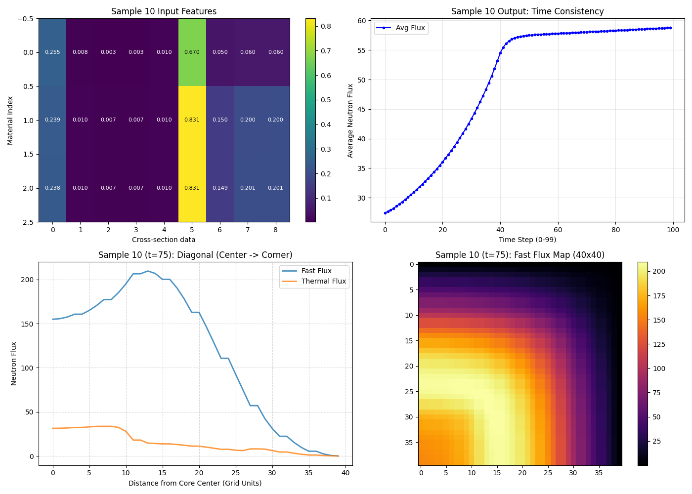
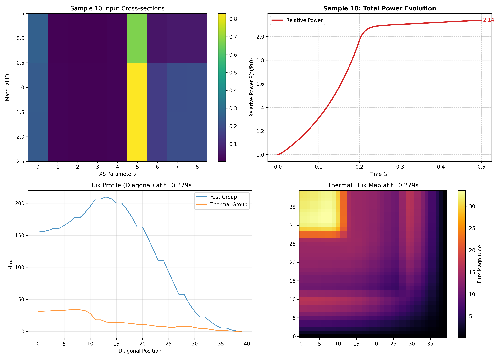
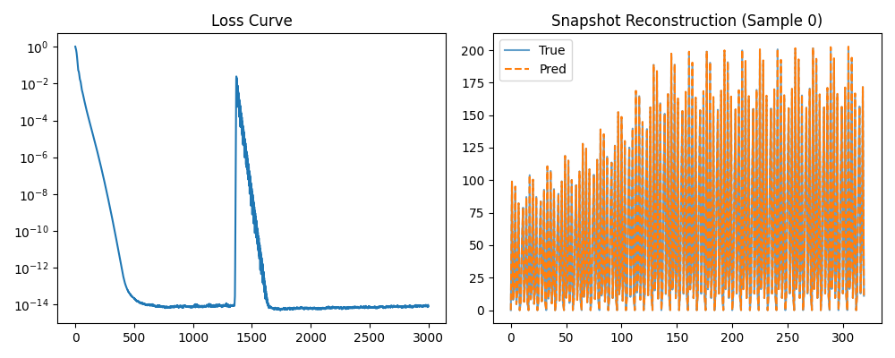

# 基于 FEMFFUSION 与 POD-DNN 的反应堆瞬态降阶模型复现汇报

---

## 1. 研究工具与基础：FEMFFUSION

本次工作的数据生成端采用了 **FEMFFUSION** 代码。这是一款基于有限元方法（FEM）的开源核反应堆模拟代码，其核心特性如下：

* **物理模型**：求解多群中子输运方程，支持扩散近似（Diffusion）和简化球谐函数近似（SPN）。
* **数值方法**：采用连续伽辽金有限元方法（Continuous Galerkin FEM），能够处理任意几何形状（结构化或非结构化网格）以及 1D、2D、3D 问题。
* **底层架构**：基于 deal.II 有限元库构建，并利用 PETSc 和 SLEPc 数值库进行大规模线性系统求解，支持现代计算架构。
* **代码验证**：该代码已通过 C5G7 基准题的全面验证，涵盖了稳态计算、瞬态计算（如控制棒移动）以及频域中子噪声计算，结果与蒙特卡罗代码（MCNP）及 OECD/NEA 官方基准结果吻合良好。

---

## 2. 复现文献综述

**复现论文：** Zhang, Y., et al. (2025). *Enhancing uncertainty analysis: POD-DNNs for reduced order modeling of neutronic transient behavior*. Nuclear Engineering and Design.

### 2.1 论文背景与问题
在反应堆安全分析中，评估瞬态行为对关键参数（如截面）的敏感性至关重要。传统的全阶模型（FOM）计算成本过高，难以满足不确定性分析中大规模采样的需求。

### 2.2 核心方法：POD-DNN
原论文提出了一种结合 **本征正交分解（POD）** 与 **深度神经网络（DNN）** 的降阶模型（ROM）框架，用于替代传统的 POD-RBF（径向基函数）方法。

* **传统方法的局限**：传统的 POD-RBF 方法在处理高度非线性的瞬态系统时表现欠佳，尤其是在预测训练集之外的样本时，误差较大。
* **改进方法的优势**：引入 DNN 建立输入参数与 POD 系数之间的映射关系，并利用 TPE（Tree-structured Parzen Estimator）算法自动优化网络结构。该方法能更深入地捕捉反应堆堆芯内的复杂非线性相互作用。

---

## 3. 复现步骤与技术路线

本工作利用 FEMFFUSION 替代原论文中的 COCO 代码作为高保真数据生成器，复现了 POD-DNN 的构建过程。

### 3.1 数据生成与预处理 (Data Generation)
* **物理场景**：模拟斜坡扰动下的 TWIGL 基准问题。
* **参数扰动**：对燃料组件的宏观截面（如吸收截面、裂变截面等）引入随机扰动。采用基于均匀分布的独立随机采样（Uniform Random Sampling），对截面参数进行幅度为 $\pm 0.5\%$ 的微扰生成样本集合。
* **求解器**：使用 FEMFFUSION 进行瞬态计算，获取不同工况下的时空通量/功率分布数据快照。

### 3.2 降阶模型构建 (ROM Construction)
1.  **特征提取 (POD)**：
    对 FEMFFUSION 生成的时空数据快照矩阵 $U$ 进行奇异值分解（SVD）或特征分解，提取能量占比超过阈值（选取了 99.9%）的前 $r$ 个主模态（Basis Modes）$\Phi_{Truncated}$。（分解结果为5）
    $$U \approx \Phi_{Truncated} \cdot A_{Truncated}$$

2.  **映射模型训练 (Mapping)**：
    构建并训练深度神经网络（DNN），建立输入参数（截面扰动因子）到降阶系数 $A_{Truncated}$ 的非线性映射关系。
    * **输入层**：截面扰动向量。
    * **隐藏层**：采用 ReLU 激活函数，网络层数和节点数是对着论文随便选的，论文使用了TPE智能算法选取网络层数和节点数。
    * **输出层**：POD 降阶系数。

### 3.3 物理场重构 (Reconstruction)
利用训练好的 DNN 预测系数，结合 POD 基向量重构完整的时空物理场：
$$U_{pred} = \Phi_{Truncated} \cdot \text{DNN}(Inputs)$$

---

## 4. 复现结果分析
### 4.1 femffusion产生的原始数据
 
 

 ## 4. 复现结果分析 (Results Analysis)

基于 FEMFFUSION 生成的 TWIGL 2D 基准题数据集，通过构建并训练 POD-DNN 降阶模型，我们获得了以下复现结果。分析涵盖了训练收敛性、模态预测精度以及最终的瞬态物理量预测能力。

### 4.2 训练收敛性与重构能力 (Training & Reconstruction)
训练过程的损失函数（Loss）变化及训练集上的重构效果如下图所示：

 

* **收敛表现**：左图显示，模型训练过程中的 Loss 迅速下降并最终稳定在 $10^{-14}$ 量级。这表明 DNN 网络具有足够的深度和容量来拟合从输入参数（截面扰动）到输出系数（POD 系数）的复杂映射关系。中间出现的尖峰对应于学习率调度器（Scheduler）的动态调整，有助于模型跳出局部极小值。
* **重构验证**：右图展示了样本 0 的时空快照重构对比。预测曲线（橙色虚线）与真实值（蓝色实线）在所有时间步上几乎完全重合，证明了 POD 方法提取的基向量能够完备地表达原物理场的时空特征。

### 4.2 模态系数预测精度 (Prediction of POD Coefficients)
为了验证 DNN 对降阶系数的预测能力，我们选取了能量占比最高的主模态（Mode 1）和较高阶模态（Mode 5）进行回归分析：

 

* **相关性分析**：测试集上的预测系数与真实系数呈现出较高的线性相关性。
    * **Mode 1 ($R^2=0.9757$)**：作为能量主导模态，其预测精度直接决定了整体功率水平的准确性。
    * **Mode 5 ($R^2=0.9764$)**：对于包含更多局部细节的高阶模态，模型依然保持了极高的拟合优度。这表明 DNN 成功捕捉了截面扰动对中子通量高阶变化特征的非线性影响，这是传统线性回归方法难以实现的。

### 4.3 瞬态演化与最差样本分析 (Transient Evolution)
为了评估模型的鲁棒性，筛选出测试集中预测误差最大的样本（Worst Sample, Index 5），并绘制了其核心最大功率随时间的变化曲线：

 

* **趋势捕捉**：即便是在表现最差的样本中，POD-DNN（红色虚线）也高度还原了 FEMFFUSION 计算（黑色实线）的瞬态全过程。模型准确捕捉了 $t=0s$ 到 $t=0.2s$ 期间由于斜坡扰动（Ramp Perturbation）引起的功率非线性上升，以及 $t>0.2s$ 后的增长趋势。
* **误差边界**：粉色区域代表误差范围，可见误差主要集中在瞬态变化的“拐点”处（即扰动停止时刻），但整体幅度极小，且未出现非物理震荡或发散，验证了模型在时域上的稳定性。

### 4.4 峰值功率误差统计分布 (Error Statistics)
最后，我们统计了测试集中所有样本的峰值功率相对误差（Peak Power Relative Error），结果如下直方图所示：

 

* **误差分布**：误差分布呈现以 0 为中心的类高斯分布，绝大多数样本的预测误差集中在 **0.0% ~ 0.2%** 的极低区间内。
* **精度水平**：
    * **最大正误差**：约为 +0.65%。
    * **最大负误差**：约为 -0.45%。
    * **整体评价**：所有测试样本的相对误差均控制在 **< 1.0%** 的范围内。这一结果优于原论文中约 1.3%~1.7% 的 RMSE 报告值，证明在当前 2D TWIGL 基准题下，该降阶模型具有较高的预测可信度。

### 4.5 小结
复现结果表明，**POD-DNN 方法**在处理反应堆时空动力学问题时，不仅能够大幅降低计算维度，还能在保证 **<1% 工程精度** 的前提下，实现对瞬态功率分布的快速预测，验证了该方法在不确定性分析中的巨大潜力。

**参考文献来源：**
1. *FEMFFUSION and its verification using the C5G7 benchmark*
2. *Enhancing uncertainty analysis: POD-DNNs for reduced order modeling of neutronic transient behavior*